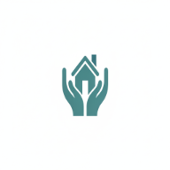

# Trygg Hand

Live web site: https://trygghand.com/

## Table of Contents

- [About](#about)
- [Marketing research](#marketing-research) 
- [Agile method](#agile-method) 
  - [Concept Chart](#concept_chart)
  - [Buisness Model](#buisness_model)
  - [ERD](#erd)
  - [User Stories](#user-stories) 
- [wireframes](#wireframes)
- [UX](#ux)
- [Design](#design)
- [Media](#media)
- [Features](#features) 
  - [Existing Features](#existing-features)
  - [Future Features](#future-features)
- [CRUD](#crud)
- [Technologies Used](#technologies_used)
- [Setup](#setup)
- [Deployment](#deployment) 
- [Testing](#testing)
  - [Validation](#validation)
  - [Manual Testing](#manual_testing)
- [Bug Report](#bugreport)
- [Acknowledgements](#acknowledgements)

### [About](#about)

This is my website for my coming buisness of services to seniors and relatives.
The site is an informing site with transparent prices, so it makes it easy to make deicisions in a difficult or stressed time.
As customer, you can alson sign in and follow every step of your package of services. In the database, you can aslo make comment to send to the coordinator.
You have a chatbot as a premium seervice when you are logged in.
The project are build as a vite with react in typescript.
I use tailwind as styling.

### [Marketing research](#marketing-research) 

I started to make research to update me of this market and see what kind of competitor there is.

### [Agile method](#agile-method) 

I have brainstormed what I want to achieve and how to plan the project.

#### [Concept Chart](#concept_chart)

### [Buisness Model](#buisness_model)
The business operates on a B2C model (Buisness-to-Consumer) and revenue comes from the servicepackage I sell.

#### [ERD](#erd)

#### [User Stories](#user-stories)
I set up a project in Github with a canban. Link to canband: https://github.com/users/Christina5P/projects/10
This project is divided into:
- Milestones

  - EPICS

    - User stories

      - Tasks
      There could also be some tasks.

### [wireframes](#wireframes)  

I used loveable to get a basic webside, to build from.

### [UX](#ux)

My goal is to keep good UX principles regarding interaction/layout/colors/
 
* Users needs

###  [Design](#design) 

To design this website I proceeded from calm and confidence colours.

- Logotype is created to simulate caring services with your home 

  

- Colors: 
 

- Favicon
I use the same image for favicon 
I also load the favicon to work on different devices

- Font
 Nunitio

 The font is a part of Sans Serif family.
 It is easy to read and thats important for my target group
 

### [Media](#media)

Image and content used from media:

* https://stocksnap.io/
* https://www.istockphoto.com/
* https://www.alamy.com/stock-photo
* https://clossue.com/eu/blog
* http://almonds.ai  
* https://urbanswall.com/luuxly-com-your-destination-for-luxury-fashion-and-lifestyle/
* https://www.lifestyleasia.com/ind/style/fashion/second-hand-luxury-is-the-new-sustainable-trend/
* https://us.vestiairecollective.com/ - I have borrowed product img from this second hand store
* https://app.logomaster.ai/ - help making a logotype
* https://www.colorhexa.com/ - Colorscheme
* https://climatepartnerimpact.com/get-involved/ - derivation to a project for donation
* http://lucid.app - Creating a concept Plan
* https://fontawesome.com/ -font awesome icons
* https://www.istockphoto.com/ -pictures

## [Features](#features) 

### [Existing Features](#existing_featuers)

#### Home

You will be inviting to action in the Homepage and view easy navigation of your interest.

#### Category / search

####  Users account

Footer

#### [Future Features](#future_features)

##### Newsletters archive
Store newsletter in an archive on the website 

### [CRUD](#crud)

-Create

-Read 

-Update
 

-Delete

### [Technologies Used](#technologies_used)

#### Platforms
* GitHub - Web-based platform to manage repository and collaboration tool.

#### IDE
* VS code
#### Languages:
* HTML
* CSS
* Typescript
* JS

#### Frameworks and libraries:
* Django
* Tailwind
* Vent

#### Databases:
* Supabase

### [Setup](#setup)

### [Deployment](#deployment) 

### [Testing](#testing)

#### [Validators](#validators)

 - Responsiveness and SEO in Lighthouse

#### [Manual Testing](manual_testing) 

### [Bug Report](#bugreport)

### [Acknowledgements](#acknowledgements)

[Go to Top](#TryggHand)
